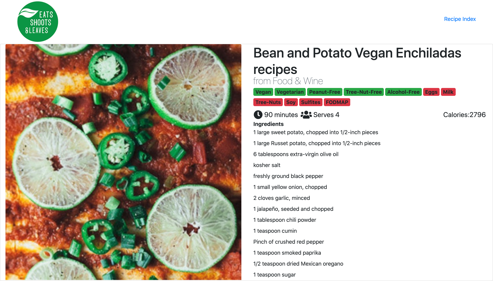
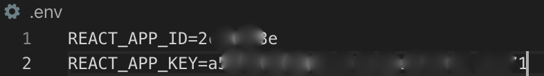

# Eats, Shoots & Leaves

"**Eats, Shoots & Leaves**" is my capstone project for Microverse's React & Redux module. The website is a filterable index of vegan recipes provided by the [Edamam Recipe Search API](https://developer.edamam.com/edamam-docs-recipe-api).

The website consists of two pages:

1) The main page, where the user may view images and titles for all the recipes and apply filters to the list of recipes shown.

2) The recipe page, which can be accessed by clicking on any of the recipe tiles on the main page. Here, the user can view more details about the recipe and follow a link to the original recipe's website.

## Live Demo

To jump right into the project, visit the [Live Demo](https://eats-shoots-leaves.herokuapp.com/), deployed on Heroku.

## Built With

- **[React](https://reactjs.org/)** - Bootstrapped using the [**create-react-app**](https://www.npmjs.com/package/create-react-app) package.
- **[Redux](https://redux.js.org/)** - Redux is used for storing state. The `react-redux` package was used to enable React bindings for Redux.
- **[React Router](https://reactrouter.com/)** - the `react-router-dom` package was used to allow navigation between pages.
- **[Bootstrap](https://getbootstrap.com/)** and **[Font Awesome](https://fontawesome.com/)** were both used, via their npm packages.
- Kent Dodds' **[Testing Library](https://testing-library.com/)** - the `/jest-dom` and `/react` APIs were used for testing, on top of Jest, which is `create-react-app`'s default testing suite.
- **ESLint** and **Stylelint** for linting JavaScript and CSS respectively.

## Local Setup

### Prerequisites

_**node.js is a pre-requisite of this project.**_

Don't have node.js? Choose a download method [here](https://nodejs.org/en/download/).

## Setup Instructions

1. Open a Terminal and navigate to the location in your system where you would like to download the project. **New to Terminal? [Learn here](https://www.freecodecamp.org/news/conquering-the-command-line-f85f5e46c07c/).**

2. Enter the following line of code to clone this repository:

`git clone git@github.com:Joseph-Burke/Eats-Shoots-Leaves.git`

3. Now that the repository has been cloned, navigate inside it using `cd Eats-Shoots-Leaves`.

4. The project's dependencies are managed by npm. The details of this project's dependencies can be found in `package.json`. To install them, enter the following line of code in the Terminal.

`npm install`

5. The project is now fully installed. The only thing left to do is set up your personal Edamam Recipe Search API credentials as environment variables. To do that, follow [this link](https://developer.edamam.com/edamam-recipe-api) and hit that "Start Now" button in the 'Developer' column.

6. Complete the form that appears and submit it. Make sure that the "Developer" option under "Recipe Search API" is selected in the "Choose your plan" dropdown.

7. Having signed up, you will now be able to log in to the Edamam website. Navigate to the Dashboard using the button in the top right of the window. Then, hit the "Applications" tab. From there, press the "Create New Application" button and choose the "Recipe Search API" option. You can then enter a name and a description for the application; you may wish to enter "Eats, Shoots and Leaves" as a name.

8. You will immediately receive an e-mail to confirm that your application has been created. On the Dashboard's "Applications" tab, your newly created app will be there. Hit the view button and you will be able to see the details of your app. The two important pieces of information are the **Application ID** and the **Application Keys**.

9. The only thing that remains is to create a file in the root directory of the project called `.env`. Enter the two variables in the `.env` file as seen in the screenshot:

10. You're ready to go! Your personal API credentials are now available inside `process.env` and will be used in the project's calls to the API - the Developer plan allows up to 5 calls per minute. 

11. Start the project with the `npm start` command.

## Tests

To run tests, simply enter the `npm test` command in the terminal. This will begin `create-react-app`'s built-in testing script, which will watch for changes and run tests automatically.

If you're interested in writing further tests for this project, refer to the documentation for [Jest](https://jestjs.io/docs/en/getting-started) and [Testing Library](https://testing-library.com/).

## Author

👤 **Joe Burke**

- Github: [@Joseph-Burke](https://github.com/Joseph-Burke)
- Twitter: [@__joeburke](https://twitter.com/__joeburke)
- Linkedin: [Joseph Burke](https://www.linkedin.com/in/--joeburke/)

## 🤝 Contributing

Contributions, issues and feature requests are always welcome!

Drop me a line through any of the channels listed above or head directly to the [issues page](issues/).

## Show your support

Hey! Give this project a ⭐️! It costs nothing :)

## Acknowledgments

- This project was built as part of the Microverse Web Development course, which you can learn more about [here](https://www.microverse.org/).

## 📝 License

This project is [MIT](lic.url) licensed.
